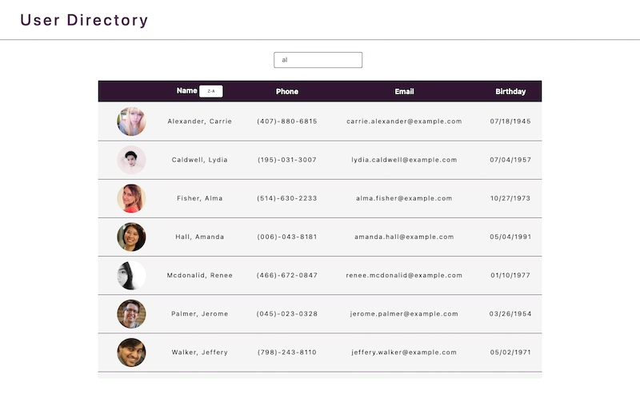

# User Directory

## Table of Contents
* [Description](README.md#Description)
* [Installation](README.md#Installation)
* [Usage](README.md#Usage)
* [URL](README.md#URL)
* [License](README.md#License)
* [Questions](README.md#Questions)

## Description
An app that allows a user to view their entire employee diectory with a search function that allows them to have quick access to employee information.

## Installation
To install, clone this from my repository by entering `git clone https://github.com/kelseysanderson/user_directory.git` in a terminal in a new directory. Then, when successfully cloned, cd into the new folder and type `npm install`.

## Usage
Following installation, type `npm start` into the terminal. This will open up the project in your browser.

### Screenshot 

## URL
[Live URL to Progressive Budget](https://kelseysanderson.github.io/user_directory/)

## License
Read more about the license here:
https://opensource.org/licenses/MIT

### Questions
If you have any questions, feel free to contact me:

GitHub: [Kelsey Sanderson GitHub](https://github.com/kelseysanderson)

Email:  [Kelsey Sanderson Email](mailto:kelseymonica@gmail.com)